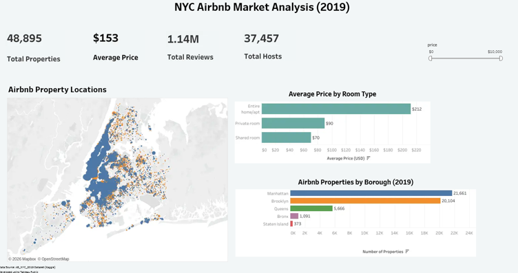

# NYC Airbnb Market Analysis (2019) (Tableau)

This project is an interactive Tableau dashboard built using the **AB_NYC_2019** dataset from Kaggle. I created it to practise building interactive dashboards in Tableau and to explore Airbnb listing trends across New York City.

The dashboard allows users to analyse Airbnb properties by borough, room type, pricing, and geographical location using interactive filters and dashboard actions.

---

## Project Objectives

- Prepare the Airbnb dataset for analysis.
- Analyse Airbnb listings across New York City.
- Build an interactive Tableau dashboard with filters and dashboard actions.
- Compare property distribution across boroughs.
- Analyse pricing by room type.
- Visualise Airbnb property locations on an interactive map.
- Present key insights through an interactive dashboard.

---

## Live Dashboard

🔗 **[View the Interactive Tableau Dashboard](YOUR_TABLEAU_PUBLIC_LINK_HERE)**

---

## Dataset

The dashboard uses the **AB_NYC_2019** dataset, which contains Airbnb listing information for New York City during 2019.

Before creating the dashboard, the dataset was reviewed, data types were verified, and fields were prepared for visualisation in Tableau.

| Column | Description |
|---------|-------------|
| `id` | Unique listing ID |
| `name` | Airbnb property name |
| `host_id` | Unique host ID |
| `host_name` | Host name |
| `neighbourhood_group` | NYC borough |
| `neighbourhood` | Neighbourhood name |
| `latitude` | Latitude coordinate |
| `longitude` | Longitude coordinate |
| `room_type` | Type of accommodation |
| `price` | Price per night (USD) |
| `minimum_nights` | Minimum nights required |
| `number_of_reviews` | Total number of reviews |
| `last_review` | Date of last review |
| `reviews_per_month` | Average monthly reviews |
| `calculated_host_listings_count` | Number of listings per host |
| `availability_365` | Days available during the year |

**Source:** Kaggle – AB_NYC_2019 Dataset

---

## Data Preparation

The data preparation process included:

- Reviewing the dataset structure.
- Checking for missing values.
- Verifying data types.
- Formatting geographic fields.
- Validating numerical fields.
- Preparing measures and dimensions for Tableau visualisations.

---

## Dashboard Features

- KPI cards displaying:
  - Total Properties
  - Average Price
  - Total Reviews
  - Total Hosts
- Airbnb property distribution by borough
- Average price analysis by room type
- Interactive property location map
- Price range filter
- Room type filter
- Dashboard action filters
- Interactive tooltips

---

## Tools Used

- Tableau Public
- Dashboard Actions
- Filters
- Calculated Fields
- Maps
- Data Visualisation

---

## Project Files

- [NYC_Airbnb_Market_Analysis_2019.twbx](dashboard/NYC_Airbnb_Market_Analysis_2019.twbx)
- [Interactive Tableau Dashboard](https://public.tableau.com/views/NYCAirbnbMarketAnalysis2019_17848381135510/AirbnbMarketAnalysisDashboard?:language=en-GB&:sid=&:redirect=auth&:display_count=n&:origin=viz_share_link)

---

## 📷 Dashboard Preview

The dashboard includes interactive filters that allow users to explore Airbnb listings by borough, room type, and price while visualising property locations across New York City.

---

## Key Findings

Some of the main insights from the dashboard include:

- Manhattan and Brooklyn contain the highest number of Airbnb properties.
- Entire home/apartment listings have the highest average nightly price.
- More than **48,000** Airbnb listings were available across New York City in 2019.
- The dataset contains over **1.14 million** customer reviews, indicating high platform activity.
- Most Airbnb hosts manage only one property.
- Interactive filters make it easy to compare boroughs, room types, and pricing trends.

---

## What I Learned

This project helped me improve my Tableau skills by designing a complete interactive dashboard from scratch.

The biggest challenge was learning how dashboard actions, filters, and interactive maps work together to create a seamless user experience. I also gained experience designing KPI cards, building geographic visualisations, and creating dashboards that communicate insights clearly.

By completing this project, I became more confident using Tableau for exploratory data analysis, dashboard development, and interactive data storytelling.

---

## Skills Demonstrated

- Data preparation
- Tableau dashboard development
- Interactive dashboards
- Dashboard Actions
- Filters
- KPI development
- Geographic visualisation
- Data storytelling
- Exploratory Data Analysis (EDA)

---

## Author

**Wioletta Zajac**
